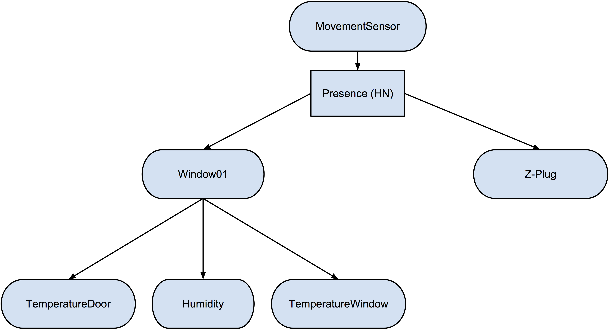

# Machine Learning for Fault Detection of Energy Consumption #

A machine learning approach for fault detection of enery consumption
values in a environment.

### Description of the environment

The environment consists in a room of about 20 square meters and it is
supposed to be used as a chill-out zone.

As depicted in the figure below, there is only one door to access the
room. On the opposite side there is a wide window. In the bottom-right corner
there are three electrical appliances: a microwave, a kettle, and a
water dispenser.

Sofas are placed on the wall in the bottom and on the wall to the left,
whereas coffee tables and chairs are present in the center of the room.

The room is equipped with the following **sensors**:

1. an open/close sensor for the windows;
2. a temperature and humidity sensor near the window;
3. a temperature and movement sensor near the door;
4. an energy consumption sensor, called _Z-Plug_, on which all the
   electrical appliances are plugged.

These sensors communicate with a central unit through (wireless) the
ZigBee protocol and the data collected are saved in a SQLite
database.

## Bayesian Networks

Bayesian networks are data structures that map the relationship between
events in terms of their probability.

More specifically, a bayesian network is a **direct acyclic graph**
where each _node_ corresponds to a random variable (either descrete or
continus) and each _direct arc_ from node _X_ to node _Y_ means that _X_
has a
_[conditional dependency](https://en.wikipedia.org/wiki/Conditional_dependence)_
on _Y_.  The direct influence is called
_[Conditional Probability Distribution](https://en.wikipedia.org/wiki/Conditional_probability_distribution)_
(**CPD**) that quantifies the effect of the parents on the child node.

Each node in a bayesian network has a specific _CPD_. In case the random
variables are discrete, the _CPD_ can be represented as a
_[Conditional Probability Table](https://en.wikipedia.org/wiki/Conditional_probability_table)_
(**CPT**). The _CPT_ lists the probability that the child node takes on
each of its different values for each combination of values of its
parents.

### Learning

The topology (structure) and the parameters of each CPD can be both
learned from data.  However, since learning structure is much harder
than learning parameters, we have designed the topology of the network
according to the method given in Chapter 14.2 of the book
_[Artificial Intelligence: A Modern Approach](http://aima.cs.berkeley.edu/)_.

The aim of our Bayesian Network is to model the environment (the room) by the data
gathered from all the sensors.

We define 6 _observable nodes_ that model the output of each sensor and
1 _hidden node_ that models the possible presence of a person inside the
room.

Number | Name | Modelled data 
------ | ----  | -----------
1	| MovementSensor	| Motion detection (_binary_)
2  | Presence (Hidden Node) | Presence inside the room  (_binary_)
3	| Window			| Window open or close (_binary_)
4	| Z-Plug			| Energy consumption (_Watt_)
5	| TemperatureDoor	| Temperature near the door (_Celsius_)
6	| Humidity			| Relative humidity (_percent_)
7	| TemperatureWindow	| Temperature near the window (_Celsius_)

The picture below shows the structure of our bayesian network.

## Dependencies

* MATLAB (https://www.mathworks.com/products/matlab.html)
* The Bayes Net Toolbox (BNT) for MATLAB (https://github.com/bayesnet/bnt)
* `mksqlite`, the MATLAB Mex-DLL to access SQLite databases (https://github.com/AndreasMartin72/mksqlite)

Optional:

* Mozila Firefox (https://www.mozilla.org/en-US/firefox/)
* The SQLite Manager Firefox Add-on (https://addons.mozilla.org/en-US/firefox/addon/sqlite-manager/)

## How to
